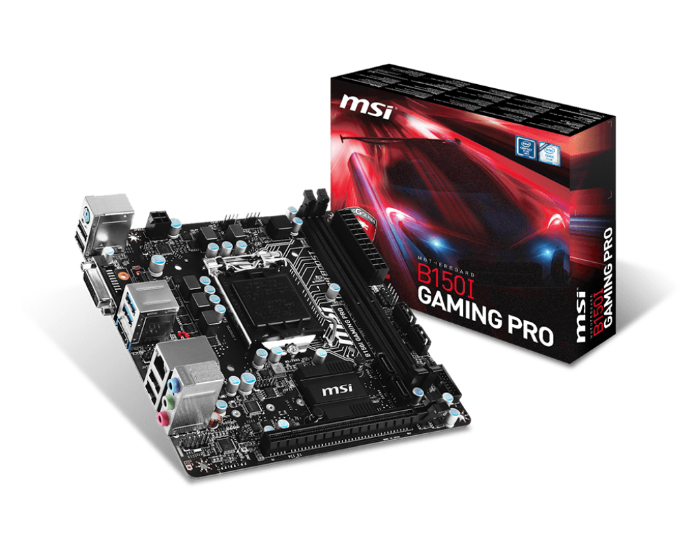

# Hackintosh MSI B150i Gaming PRO

 

## 硬件 / Hardware
| 项目 | 内容 | 备注 |
| ----- | ----- |-----|
| 处理器 / CPU | Intel i5-7500 ( 4C + 4T ) | 7代核显可以驱动 |
| 主板 / MB | 微星-MSI-B150i-Gaming-PRO | 内存为DDR4 |
| 内存 / RAM | TeamGroup 十铨 火神 8GB DDR4 3200 Mhz | 便宜又好用 |
| 显卡 / DGPU | 七彩虹 GeForce GT730K LP 2GD3 | BigSur免驱 |
| 有线网络 / Lan | Realtek RTL8111H | 千兆网络 |
| 无线 + 蓝牙 : Wifi + Bluetooth | 博通 BCM94352Z (闲鱼版本) | 可用，需加驱动 |
| 音频 / Audio | Realtek ALC887 |  |
| 固态硬盘 / NVMe | 西部数据 WD SN730 512GB |  |
| 处理器散热 / CPU Fan | 海盗船 H100i 120水冷 |  |
| 电源 / Power | 安钛克VP450 450瓦 |  |
 

## 软件 / Software
| 项目 | 内容 | 备注 |
| ----- | ----- | ----- |
| SMBIOS | Macmini8,1 | 也可替换 iMac18,3 |
| BootLoader | OpenCore 0.9.4 | 最新 |
| macOS | 11.X BigSur | 虽然12，13也可以，但是11支持显卡免驱 |
 

## 工作情况 / Fuctional
### 视频 / Display
|| 项目 | 内容 | 备注 |
|-----| ----- | ----- | ----- |
|✅| 核显 | UHD630 七代 | 仿冒ID：12590000 手动定制HDMI端口，否则会黑屏 |
|✅| 独立显卡 | GT730K | 11.X下免驱 |
 

### 音频 / Audio
|| 项目 | 内容 | 备注 |
|-----| ----- | ----- | ----- |
|✅| 音频 | ALC887 | 使用`AppleALC.kext` 可驱动，对应ID为1； |
 

### 电源管理、睡眠、休眠 / Power, Sleep and Hibernation
✅ 电源管理使用 `SSDT-PLUG-DRTNIA` 即可解决；

⚠️ 关于睡眠和休眠：本人没有配置；因为本人台式机用不到。
 

### 无线和蓝牙 / WiFi + Bluetooth
|| 项目 | 内容 | 备注 |
|-----| ----- | ----- | ----- |
|✅| 无线 | 博通BCM94352Z (闲鱼版本) | 使用如下驱动： AirportBrcmFixup.kext |
|✅| 蓝牙 | 博通BCM94352Z (闲鱼版本) | 使用如下驱动： BlueToolFixup.kext BrcmBluetoothInjector.kext BrcmFirmwareData.kext BrcmPatchRAM3.kext |
 

### USB端口 / USB Port
|| 项目 | 内容 | 
|-----| ----- | ----- | 
|✅| XhciPortLimit方法 | OpenCore升级到0.9.3版本之后，可以直接使用 XhciPortLimit + USBInjectAll.kext_v0.8.0 解除USB限制； |
|✅| USB定制方法 | 已使用工具定制端口：USBMap_macmini81.kext |

 

## BIOS 相关
|| 项目 | 内容 | 
|-----| ----- | ----- | 
|❌| 关闭 | Resizable BAR | 
|❌| 关闭 | Fast Boot 快速启动 | 
|❌| 关闭 | VT-d | 
|❌| 关闭 | CSM | 
|❌| 关闭 | Intel SGX | 

|| 项目 | 内容 | 
|-----| ----- | ----- | 
|✅| 开启 | VT-X |
|✅| 开启 | Above 4G decoding |
|✅| 开启 | Hyper-Threading |
|✅| 开启 | EHCI/XHCI Hand-off |
|✅| 开启 | OS type: Windows UEFI Mode (或者清除所有 Secure Boot Keys 然后选 `Other` ) |
|✅| 开启 | DVMT Pre-Allocated(iGPU Memory): 64MB |
 

## Refrence / 必读参考资料

- [dortania's OpenCore Install Guide](https://dortania.github.io/OpenCore-Install-Guide/)
- [dortania's OpenCore Post Install Guide](https://dortania.github.io/OpenCore-Post-Install/)
- [dortania Getting Started with ACPI](https://dortania.github.io/OpenCore-Post-Install/)
- [dortania opencore multiboot](https://github.com/dortania/OpenCore-Multiboot)
- [WhateverGreen Intel HD Manual](https://github.com/acidanthera/WhateverGreen/blob/master/Manual/FAQ.IntelHD.en.md)
- `Configuration.pdf` and `Differences.pdf` in each OpenCore releases.
- [daliansky/OC-little](https://github.com/daliansky/OC-little)
- [OpenCore 简体中文参考手册 (非官方)](https://oc.skk.moe)

**务必阅读上述参考资料**
